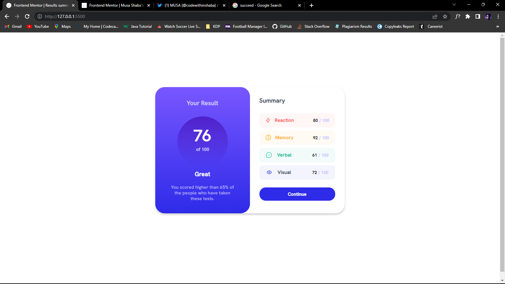
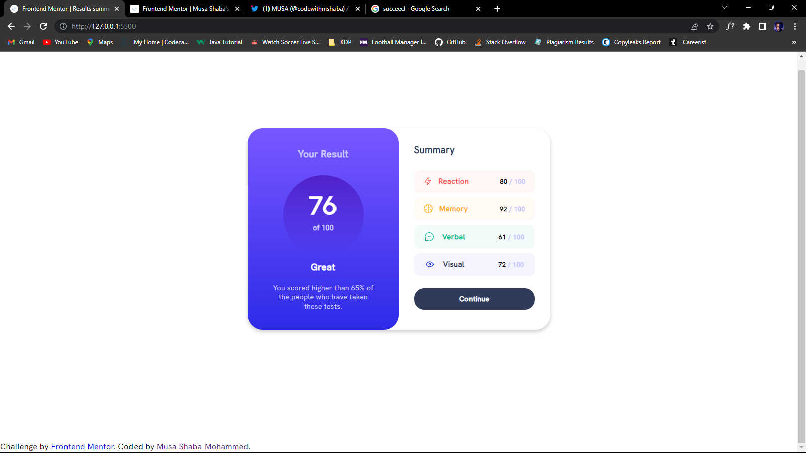
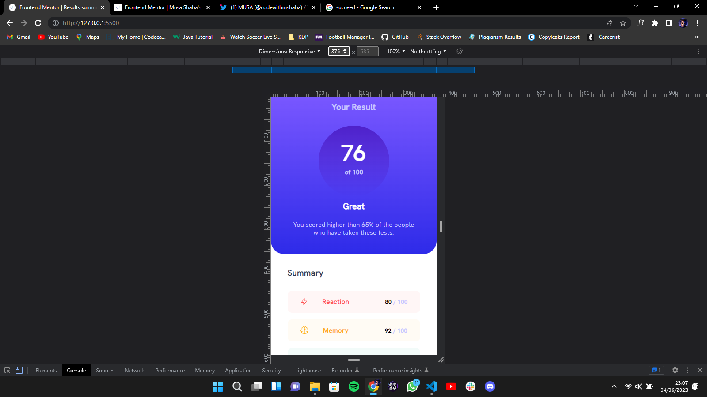

# Frontend Mentor - Results summary component solution

This is a solution to the [Results summary component challenge on Frontend Mentor](https://www.frontendmentor.io/challenges/results-summary-component-CE_K6s0maV). Frontend Mentor challenges help you improve your coding skills by building realistic projects.

## Table of contents

- [Overview](#overview)
  - [The challenge](#the-challenge)
  - [Screenshot](#screenshot)
  - [Links](#links)
- [My process](#my-process)
  - [Built with](#built-with)
  - [What I learned](#what-i-learned)
  - [Continued development](#continued-development)
  - [Useful resources](#useful-resources)
- [Author](#author)
- [Acknowledgments](#acknowledgments)

**Note: Delete this note and update the table of contents based on what sections you keep.**

## Overview

### The challenge

There wasn't a single challenge

### Screenshot

image above.

**Note: Delete this note and the paragraphs above when you add your screenshot. If you prefer not to add a screenshot, feel free to remove this entire section.**

### Links

- Solution URL: [Add solution URL here](https://your-solution-url.com)
- Live Site URL: [Add live site URL here](https://your-live-site-url.com)

## My process

### Built with

- Semantic HTML5 markup
- CSS custom properties
- Flexbox
- Position properties
- Desktop-first workflow

**Note: These are just examples. Delete this note and replace the list above with your own choices**

### What I learned

I really learnt the differences between media queries

`@media screen and (max-width:### and  min-width:###`

**Note: Delete this note and the content within this section and replace with your own learnings.**

### Continued development

I think this would be the end and final end of this project for me no more developments

**Note: Delete this note and the content within this section and replace with your own plans for continued development.**

### Useful resources

- [Example resource 1](https://www.example.com) - This site helped me in setting box-shadowing and some media queries doubt i was having.

**Note: Delete this note and replace the list above with resources that helped you during the challenge. These could come in handy for anyone viewing your solution or for yourself when you look back on this project in the future.**

## Author

- Website - [musashaba-1490d.web.app](https://musashaba-1490d.web.app/)
- Frontend Mentor - [@walidshaba](https://www.frontendmentor.io/profile/walidshaba)
- Twitter - [@codewithmshaba](https://twitter.com/codewithmshaba)

**Note: Delete this note and add/remove/edit lines above based on what links you'd like to share.**

## Acknowledgments

To start all thanks to Allah SWT who has made me being alive today and i hope he would give me strenght, guidance and whatever i need to succeed in this career path and whatever i need in this life 📿.
Secondly would like to give all thanks to my parents who have been in strong support of my tech journey, i hope i could make them really proud. i know i make you proud all day, i just this one to really count cause it is important to me.

**Note: Delete this note and edit this section's content as necessary. If you completed this challenge by yourself, feel free to delete this section entirely.**
